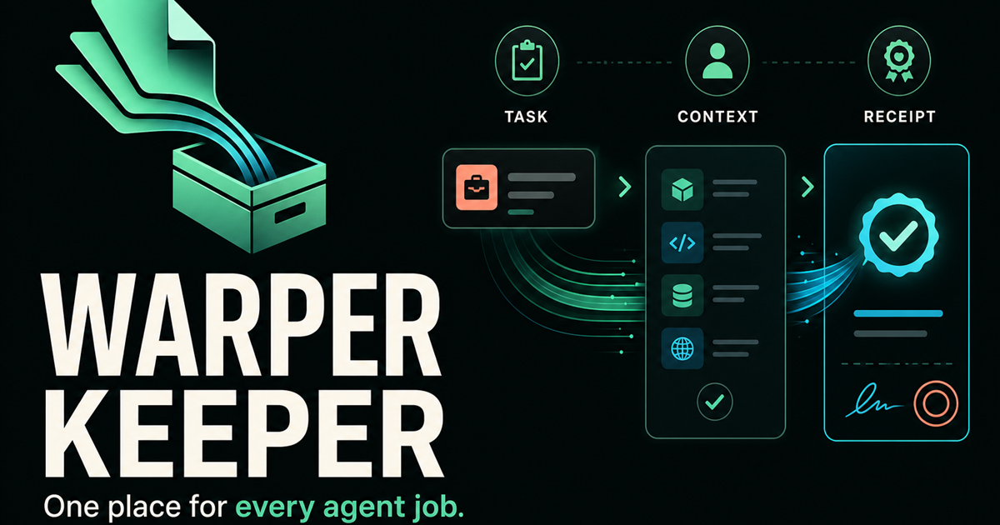

# Warper Keeper

**One place for every agent job.**

Warper Keeper is a user-facing DreamNet Mini App for organizing agent work from
request to proof. A Keeper holds bounded tasks, their source context, operating
limits, artifacts, and verifiable completion receipts.

[Open Warper Keeper](https://warper-keeper.dreamnet.ink)



## What You Can Do

- Create a Keeper for a project or area of work.
- Personalize its cover line, color system, and stickers.
- Open a focused task with a clear goal and completion rule.
- Build a reusable library from notes, links, and public GitHub repositories.
- Pin public repositories to the commit inspected when they were added.
- Connect related sources and attach only the context a task needs.
- Build tamper-evident context packs for agent handoffs.
- Close completed work with a deterministic SHA-256 receipt.
- Import or export a complete Keeper as portable JSON.
- Download receipts and proofed context packs as JSON.
- Use the same product in Farcaster or a standard browser.

Outside Farcaster, the current preview stores your workspace on the device.
Inside Farcaster, Quick Auth connects the workspace to a durable D1-backed
account.

## Architecture

```text
Farcaster Mini App or browser
             |
      Warper Keeper UI
             |
   Quick Auth + Cloudflare D1
             |
   Private agent gateway health
             |
   DreamNet agents and receipts
```

The public app never receives a Railway operator token. Farcaster account state
lives in Cloudflare D1, while the private Warper Keeper gateway remains the
bounded integration surface for agent runtimes. Browser preview state stays on
the device.

Public GitHub sources are inspected through GitHub's public API and recorded
with their current commit SHA. Warper Keeper does not clone or execute imported
repositories.

## Local Development

Requirements: Node.js 22.13 or newer.

```bash
npm install --legacy-peer-deps
npm run dev
```

Validation:

```bash
npm run lint
npm test
```

## Farcaster

The app calls `sdk.actions.ready()` after initialization, publishes an
`fc:miniapp` embed, serves its manifest from
`/.well-known/farcaster.json`, and uses Farcaster Quick Auth for durable
account state.

## Status

Warper Keeper is in public beta. Receipts prove what the app recorded; they do
not independently certify the quality or truth of an agent's result.

## License

Apache-2.0. See [LICENSE](LICENSE).
